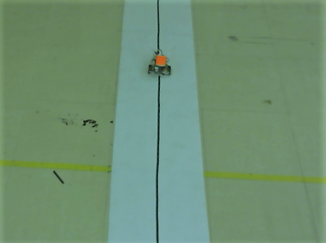
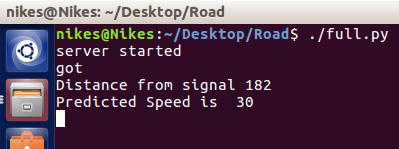

# Machine Vision Assisted Elimination of Traffic using Intelligent Control

The traffic density on roads has been on an exponential 
rise since the advent of automobile revolution. Since
then there has been some approaches for traffic management
such as traffic light control based on load, traffic density
calculation based on IR etc. An efficient algorithm using image
processing techniques and intelligent control is proposed to
completely obliterate traffic. The prototype has been developed
and successfully tested using a miniature model of a rover and a
wall mounted camera. In real time environments, this setup is
analogous to cars with GPS and satellite cameras giving live
traffic data on roads. The algorithm works in such a way that the
vehicles are tuned to move at a calculated speed at which they
avoid stopping at traffic signals which leads to reduction of
traffic. This approach also helps us in the reduction of vehicle
particulate emissions and improving the fuel efficiency, battery
life in case of electric vehicles.

## Image seen from camera frame without perspective transformation:

  

## Perspective Transformation:

  

Experiments have been carried out and data has been logged
for certain conditions. Switching time of the signal has been
varied as 1,1.5,2 seconds. 
If the switching time of the signal is 1s, and distance
of rover from signal is less than 100cm, a speed of 30 rpm
would be sufficient to cross the signal. When the distance of
rover from signal exceeds 250 cm, then predicted would
exceed the maximum speed of vehicle, so the algorithm
predicts the new speed to make the rover cross the signal at
the next iteration, so the new predicted speed is brought down
to 40 rpm.
It is sufficient that the
rover maintains a minimum speed of 30 rpm for distance less
than 150cm in case of signal switching time being 1.5s and
distance less than 200cm in case of signal switching time
being 2s, after which the speed increases gradually with the
distance.

A simulation was tested and validated successfully using Anylogic software.
The stop lanes are analogous to the signals in the below photo.

## Simulation Output:

  

## Instantaneous Output seen in Terminal:

  

Mentions :

A research paper has been accepted relating to this work in a IEEE conference.

### V Jeya Maria Jose, M Anand, Vibashan V S, DC Vivek; "Machine Vision Assisted Elimination of Traffic using Intelligent Control" ; IEEE International Conference on Inventive Systems and Control 2018 ( ICISC 2018 )

## Simulation Video Link :
https://drive.google.com/file/d/1YbCorRTut3Z8BakVc2NcKeiG2ujL_xa1/view?usp=sharing

